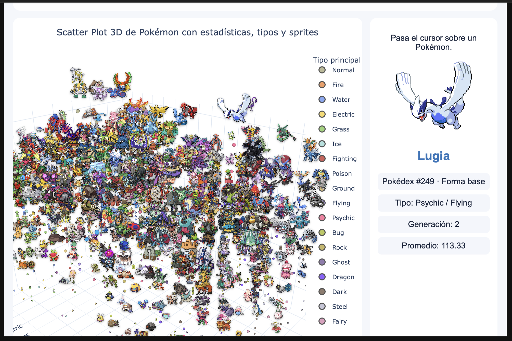

# Práctica 08: Scatter Plot 3D con sprites de Pokémon

## Portada

| Dato | Información |
| --- | --- |
| **Estudiante** | Al Farias Leyva |
| **Matrícula** | 230389 |
| **Grupo** | 9A IDGS |
| **Fecha** | 6 de agosto de 2026 |
| **Asignatura** | Análisis de Datos para Negocios Digitales |
| **Título** | Scatter Plot 3D con sprites de Pokémon |
| **Repositorio de Git** | [ECBD_9AIDGS_PRACTICAS_230389](https://github.com/fariasdgs/ECBD_9AIDGS_PRACTICAS_230389) |

## Objetivo

Analizar un conjunto de datos con estadísticas de Pokémon mediante Python, Pandas, NumPy y Plotly, aplicando procesos de inspección, limpieza y análisis estadístico para construir una visualización tridimensional interactiva. La gráfica relacionará la generación, el tipo principal y el promedio de estadísticas de cada Pokémon, incorporando colores, información emergente, filtros y sprites para facilitar la identificación e interpretación de patrones y valores atípicos.

## Descripción

La práctica utiliza el dataset público `Pokemon.csv`, con información de las generaciones 1 a 9: nombre, tipos, HP, ataque, defensa, ataque especial, defensa especial y velocidad.

Después de inspeccionar y limpiar los datos, el Notebook calcula `promedio_estadisticas` y genera un Scatter Plot 3D interactivo. Cada punto representa un Pokémon e incluye su nombre, tipo, generación, promedio y sprite. La visualización permite filtrar por generación, tipo y rango de estadísticas.

## Evidencia



La versión completa puede abrirse desde [pokemon_scatter_3d_sprites.html](./pokemon_scatter_3d_sprites.html).

## Archivos

| Archivo | Descripción |
| --- | --- |
| [Practica_08_Pokemon_3D_230389.ipynb](./Practica_08_Pokemon_3D_230389.ipynb) | Notebook con el análisis y la visualización |
| [Pokemon.csv](./Pokemon.csv) | Dataset utilizado |
| [pokemon_scatter_3d_sprites.html](./pokemon_scatter_3d_sprites.html) | Gráfica interactiva exportada |
| [screenshotScatter3D.png](./screenshotScatter3D.png) | Captura de la gráfica final |

## Ejecución

Desde la raíz del repositorio:

```bash
python3 -m pip install pandas numpy plotly jupyter
jupyter notebook Practica08/
```

Abrir el Notebook y ejecutar todas las celdas en orden. La versión entregada fue comprobada con 24 celdas de código ejecutadas sin errores.
