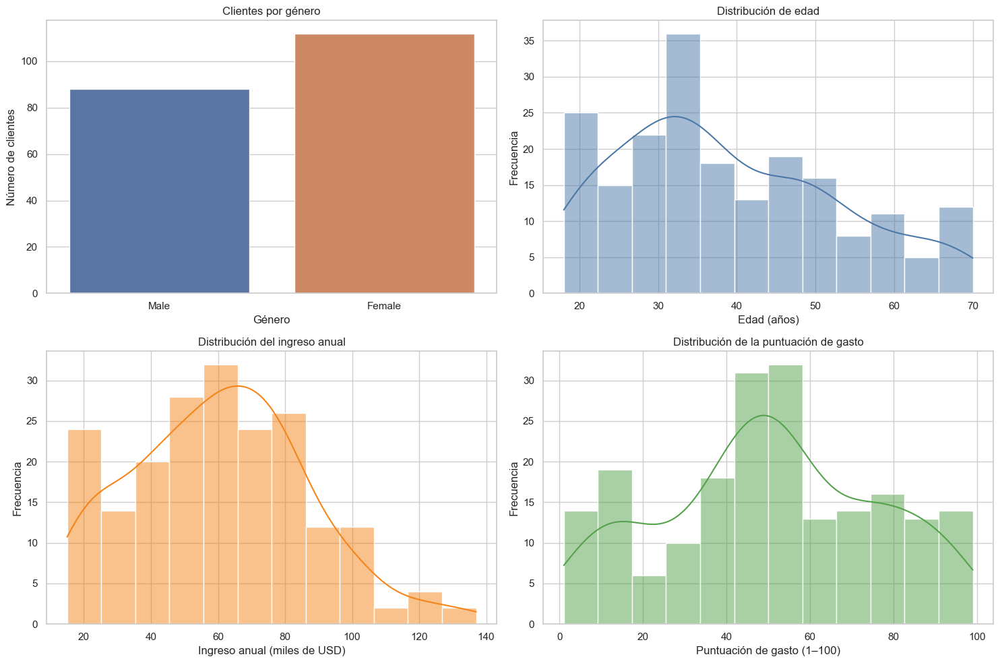
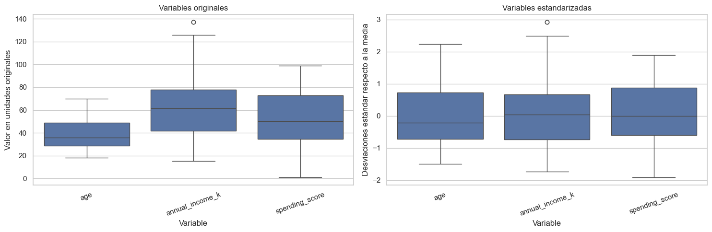
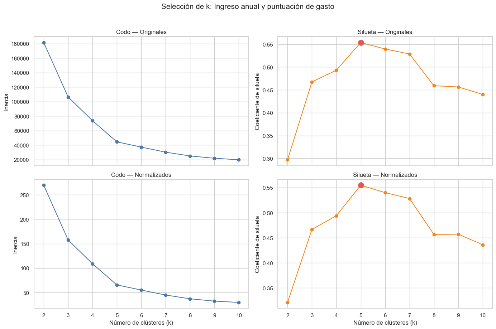
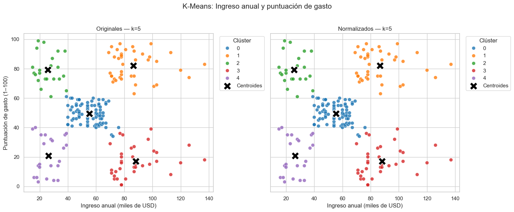

# Práctica 09: Segmentación de clientes con K-Means

## Portada

| Dato | Información |
| --- | --- |
| **Institución** | Universidad Tecnológica de Xicotepec de Juárez |
| **Asignatura** | Análisis de Datos para Negocios Digitales |
| **Unidad** | Unidad 4 — Aprendizaje no supervisado |
| **Estudiante** | Al Farias Leyva |
| **Matrícula** | 230389 |
| **Grupo** | 9A IDGS |
| **Fecha** | 11 de agosto de 2026 |
| **Notebook original** | [Unsupervised Learning: 3-6 Clusters \| K-Means \| EDA](https://www.kaggle.com/code/tanmay111999/unsupervised-learning-3-6-clusters-k-means-eda) |
| **Repositorio** | [ECBD_9AIDGS_PRACTICAS_230389](https://github.com/fariasdgs/ECBD_9AIDGS_PRACTICAS_230389) |

## Objetivo

Aplicar K-Means para segmentar clientes de un centro comercial a partir de edad, ingreso anual y puntuación de gasto. Se comparan datos originales y normalizados, seleccionando el número de clústeres mediante el método del codo y el coeficiente de silueta.

## Contenido del análisis

- Inspección, limpieza y validación de `Mall_Customers.csv`.
- Estadística descriptiva y análisis exploratorio.
- Codificación de género sin interpretación ordinal.
- Normalización con `StandardScaler`.
- Tres combinaciones de variables en versión original y normalizada.
- Evaluación de `k=2` a `k=10` mediante inercia y silueta.
- Seis modelos finales con centroides y métricas.
- Perfiles de clientes, comparación y limitaciones.

## Evidencias gráficas

### 1. Análisis exploratorio



Las distribuciones muestran la diversidad demográfica y de comportamiento presente en los 200 clientes.

### 2. Comparación antes y después de normalizar



La estandarización coloca edad, ingreso y gasto en una escala comparable para evitar que una variable domine las distancias de K-Means.

### 3. Selección del número de clústeres



El método del codo y la silueta coinciden en seleccionar `k=5` para ingreso anual y puntuación de gasto, tanto con datos originales como normalizados.

### 4. Segmentación final



La segmentación distingue cinco perfiles de clientes y muestra sus centroides. Las versiones original y normalizada producen la misma partición (`ARI=1.0`).

<details>
<summary>Ver las demás gráficas generadas</summary>

- [Valores atípicos](./images/02_valores_atipicos.png)
- [Relaciones bivariadas y correlación](./images/03_relaciones_bivariadas_y_correlacion.png)
- [Gráfico de pares](./images/04_pairplot_variables.png)
- [Métricas de edad e ingreso](./images/06_metricas_edad_ingreso.png)
- [Métricas de edad y gasto](./images/07_metricas_edad_gasto.png)
- [Clústeres de edad y gasto](./images/10_clusters_edad_gasto.png)

</details>

## Archivos

| Archivo | Descripción |
| --- | --- |
| [Practica_09_KMeans_230389.ipynb](./Practica_09_KMeans_230389.ipynb) | Notebook documentado y ejecutado |
| [Mall_Customers.csv](./Mall_Customers.csv) | Dataset de 200 clientes descargado de [Kaggle](https://www.kaggle.com/datasets/kandij/mall-customers) |
| [EVIDENCIA_EJECUCION.md](./EVIDENCIA_EJECUCION.md) | Resumen de la ejecución y modelos finales |
| [`images/`](./images/) | Evidencias gráficas exportadas |
| [requirements.txt](./requirements.txt) | Dependencias mínimas |

## Ejecución

Desde la raíz del repositorio:

```bash
python3 -m pip install -r Practica09/requirements.txt
jupyter notebook Practica09/Practica_09_KMeans_230389.ipynb
```

Ejecutar todas las celdas en orden mediante **Kernel → Restart & Run All**.

## Estado

Práctica completada. El Notebook fue ejecutado completamente: 25 celdas de código en orden, cero errores y 10 comprobaciones automáticas correctas.
